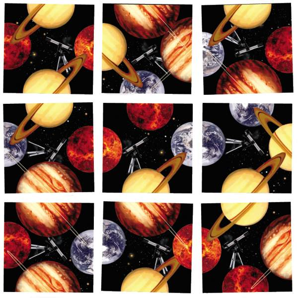

# ScrambleSolver by Jacek Strotz
A computer program which solves the famous Scramble Squares puzzle.

## About

Scrambles Squares, a toy produced by **b.dazzle, inc** with the slogan **"Easy to Play, Hard to Solve"** is a puzzle that has actually presented 
itself in familiar quantities to programmers everywhere. The puzzle seems simple: there are 9 squares, each with their own unique permutation
of one of four different categories of pictures. For example, the **Scramble Squares Planets Edition** have 4 planets: Earth, Mars, Jupiter,
and Saturn. However, each planet is split into two halves and each image is randomly selected for a random side of a square. Therefore,
the idea and objective of the game becomes simple: match each square so that the halves of the connecting image combine to form the 
entire image. 

## Purpose

When looking at the puzzle typically intended for children, it is hard to imagine a purpose for programmers to attempt such a challenge. To give
a perspective of the intensity of the puzzle, a relevant property is statistics. Below are the possibilities:
* Each puzzle has **9** pieces
* Each piece has **4** rotations
* There are **9!** permutations of the board, without rotation
* There are **4^9** separate permutations with rotation
* **Conclusion: There are 9! * 4^9 (over 95 billion) permutations of this puzzle**

This means that if a regular person were to discover a new permutation every second, and record old permutations to ensure novelty,
it would take them over **3000** years to complete the puzzle in the worst case scenario.

Unfortunately, this is a severely impractical approach. Therefore, the immaculate processing time of computers that we use everyday comes to great use.
Assuming an **average CPU clock rate** of **3.2GHz**, we can predict that ten permutations of this puzzle will take a computer about **3 nanoseconds**.
For comparison, a nanosecond is **one-billionth of one second**. If a computer uncovers the worst case scenario of **95 billion permutations**, it would
only take **28 seconds** to uncover the solution. Luckily, ending up with the worst possible scenario is statistically unlikely.

## Similar

Once the colorful graphics and backstory are removed from the **Scramble Squares** puzzle (leaving only numbers), it becomes a visual approach to a similar scenario: 
bruteforcing passwords. And even more generally, cracking a "code." It is possible that a puzzle could be replicated with the simple approach
of **Scramble Squares** with a physical reward for completion: a hidden message. The better that programmers can optimize bruteforcing
techniques (such as used in this solver, as the puzzle appears to have no reversible logic), the faster we can uncover important messages.
**Scramble Squares** is essentially a physical explanation of how bruteforcing works, and an interesting one at best.

## Attributions

This puzzle was a challenge given to me in 2021 by Dr. Anne Triplett and Prof. Blase Cindric of the University of Mount Union.
Therefore, I attribute this challenge to the following people:
* Dr. Anne Triplett, for introducing me to the **Scramble Squares** puzzle a measly fifteen minutes before a Multivariable Calculus exam
* Prof. Blase Cindric, for motivating me to push my capabilities in every Computer Science project
* Dr. Gerald Wuchter, for being the professor that made me consider Mathematics a "hobby"
* Dr. Vahraz Honary, for encouraging me to "only make high jumps" - a philosophy which I used to accomplish this challenge

## Takeaway

From this project, I learned a multitude of new things about general programming.
* I now understood the depth of the penalty I took for being a non-visual programmer (many techniques **required** a drawing)
* Sometimes, it is best to take a break and **consume nutrients** in-between sections of the project (a technique I did not make use of)
* The best solutions come to mind while you are distracted
* **“You know more than you think you know, just as you know less than you want to know.” - Oscar Wilde**
